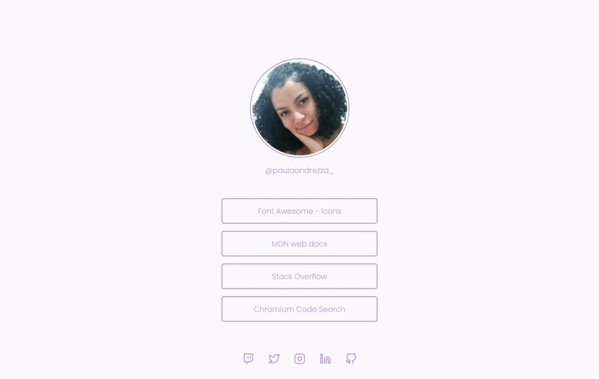

<h1 align="center"> Social Tree </h1>

    Repositório para uma página com uma lista de links que pode ser usada em perfis de redes sociais.

 

  
  

 

## 🚀 Tecnologias

Esse projeto foi desenvolvido com as seguintes tecnologias:

- HTML e CSS
- JavaScript

 

## 🔖 Layout

Você pode visualizar o layout do projeto através [DESSE LINK]("https://www.figma.com/file/yi1ycIyAW8QiGiX9bMFHkU/DD-%2F-Social-links/duplicate"). É necessário ter conta no [Figma](https://figma.com) para acessá-lo.